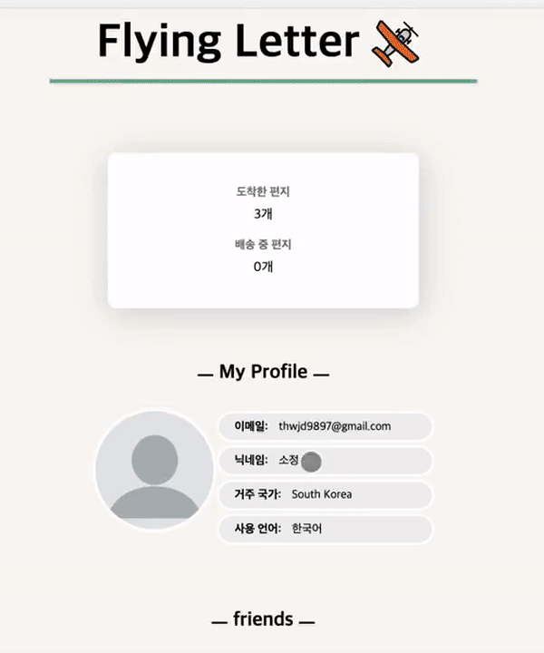
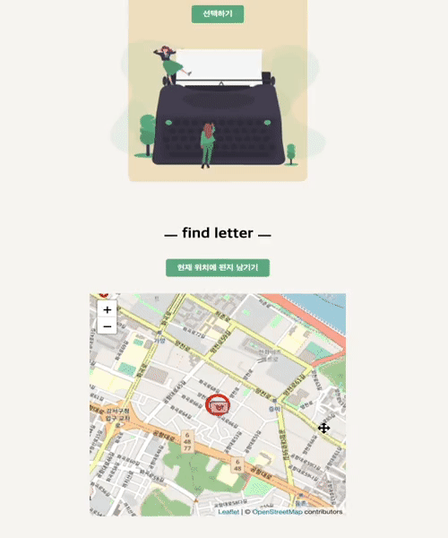
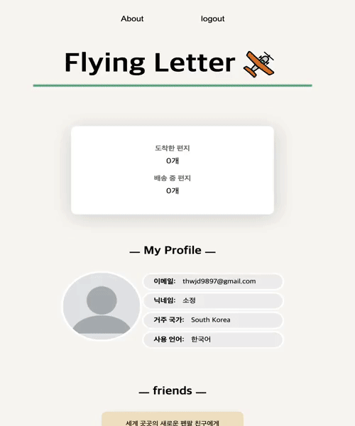
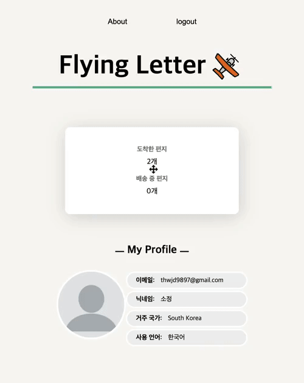

# **💌 Flying-Letter**

<image src="./readme-assets/login.gif" width="300px" />

## **<i>slow online letter! </i>**

해외에 사는 혹은 국내에 사는 펜팔 친구를 만들어 편지를 보내보세요!  
온라인 편지지만 마치 실제 편지를 보내는 것처럼 배송 되는데에 시간이 소요됩니다.  
지금 편지가 어느 나라를 지나는지, 어느 지역을 지나는지 지도에서 **실시간**으로 볼 수 있습니다!  
편지의 현재 위치뿐만 아니라 현재 위치의 날씨까지 **귀여운 애니매이션**과 함께 확인하실 수 있습니다!

 
 

# **💡 Motivation**

클릭 한번으로 원거리의 사람과 영상통화, 메세지 주고 받기가 간편해진 사회에서 아날로그적인 감성을 느낄 수 있는 웹사이트를 만들고 싶었습니다.  
게다가 편지가 현재 어디를 지나고 있는지 또 현재 위치의 날씨는 어떤지 시각적으로 보여주면 재미있는 작업이 될 것 같다고 생각하여 본 프로젝트를 진행하게 되었습니다.

 

# **🔗 관련 링크**

- **Deploy Site** : **https://www.flying-letter.xyz/**

- **Github Repositories**

  - FrontEnd : **https://github.com/sojungLIMM/flyingLetter-frontend**
  - BackEnd : **https://github.com/sojungLIMM/flyingLetter-backend**

 
 

# **🗓 Planning**

### **프로젝트 기간**

- **2021.02.21 ~ 2021.02.27 (1주차)**

  아이디어 기획

  목업 디자인

  세부 기능 설계 및 검증

- **2021.02.28 ~ 2021.03.06 (2주차)**

  개발 진행

- **2021.03.07 ~ 2021.03.18 (3주차)**

  개발 마무리

  배포(netlify, AWS Elastic BeanStalk)

  테스트코드 작성

 
 

# **🧳 STACK**

_**FrontEnd**_

- JavaScript ES2015+
- React
- React Router Dom
- Redux (Redux-Toolkit)
- Redux Thunk
- Styled-Component
- leaflet.js

_**BackEnd**_

- Nodejs
- Express
- MongoDB
- Mongoose
- JWT (JSON Web Token)
- multer
- AWS-S3

 
 

# **📌 Feature**

`편지보내기`

  
1. 원하는 펜팔 친구를 골라 편지를 보낸다.

  

    

      
    

  

- 친구 목록 페이지에 들어가 원하는 친구를 선택한다.
- 친구에게 편지를 보낸다. 자신이 원하는 이미지를 편지지로 사용할 수 있다.

  
2. 자신의 위치 근처에 있는 편지를 확인하고 답장을 보낸다.

  

    

      
    

  

- 자신의 현재 위치 중심으로 지도가 보이고 근처에 편지가 남겨져 있다면 마커를 볼 수 있다.
- 마커를 선택하면 편지를 남긴 친구의 정보를 볼 수 있다.
- 편지를 읽고 원하면 답장을 보낼 수 있다. 답장을 보내면 해당 편지는 지도에서 사라진다.

 

`현재 위치에 편지 남기기`

  
1. 자신이 현재 위치하고 있는 장소에 편지를 남겨 둘 수 있다.

  

    

      
    

  

 

`편지 확인하기`

  
1. 배송 완료된 편지만 내용을 확인 할 수 있다.

  

  

      
    

  

  
2. 배송 중인 편지는 편지가 이동하는 경로와 현재 위치, 현재 위치에 따른 <strong>날씨 상황</strong>을 알 수 있다.

  

    

      
      
      
    

    

      Clear
      Clouds
      Fog
    

    

      
      
      
    

    

      Rain
      Sand
      Snow
    

    

      
      
    

    

      ThunderStorm
      Tornado
    

  

- 날씨 상태는 총 8가지가 존재합니다.

  
3. 실시간 배송 확인 페이지에서 편지가 도착하게 되면 모달창이 뜹니다.

  

  

      
    

  

- 확인을 누르면 메인 페이지로 가게 됩니다.

 
 

# **📘 PROJECT LOG**

### **<i>❓ why redux </i>**

어느 페이지를 가도 유저의 정보를 알아야하는 상황이 빈번하여 전역 상태관리가 필요하다고 생각이 들어 redux를 사용하게 되었습니다. redux를 쓰기로 한 이상, 모든 상태관리를 리덕스로 해야할 것만 같았습니다.

<i>하지만 리덕스 공식홈페이지에서 다음과 같은 글을 보았습니다. </i>

> Redux is a valuable tool for organizing your state, but you should also consider whether it's appropriate for your situation. Don't use Redux just because someone said you should - take some time to understand the potential benefits and tradeoffs of using it.
>
> > I would like to amend this: don't use Redux until you have problems with vanilla React. - Dan Abramov

> > You'll know when you need Flux. If you aren't sure if you need it, you don't need it. - Pete Hunt

따라서 정말 필요하다고 생각된 유저의 정보만 전역 상태관리를 해주었습니다. 하지만 무한스크롤링을 적용한 곳에서 유저가 지금 보고 있는 페이지를 전역상태로 관리 해주었다면 언마운트 후 다시 마운트 될 때 마지막 페이지부터 다시 볼 수 있게 되어 사용자에게 더 좋지 않았을까 하는 아쉬움이 남습니다.

 

### **<i>❓ why leaflet.js</i>**

- 공식 홈페이지의 documetation이 읽기 쉽고 커뮤니티도 잘 되어 있습니다. 라이브러리를 사용하기 위해서는 이해하고 공부하는 과정이 필수적인데 정리가 간결하게 되어있어 이해하기가 쉬웠고 문제를 검색하면 다양한 답변을 찾을 수 있었습니다.
- 지도 라이브러리가 제공하는 다양한 서비스(교통상황, 길찾기 등)을 사용하지 않기 때문에 지도에 집중되어있는 api인 leaflet을 선택하였습니다.
- 코드의 크기(38kb)가 작아서 marker, polyline, popup 기능만 쓰고 있는 본 프로젝트에서 쓰기 적합하다고 판단하였습니다.

 
 

# **🔥 CHALLENGE**

### **<i>🔆  실시간으로 변하는 편지 마커의 위도 경도를 구하는 어려움.</i>**

출발지와 도착지가 직선으로 연결되어 있고 그 선을 따라 마커가 실시간으로 이동하는 것과 동시에 현재 위치의 날씨를 보여주고 싶었습니다. 그러기 위해서 사용할 openWeather api에 위도 경도 값을 포함하여 get요청을 해야합니다.  
<i>`따라서 마커의 위치가 폴리라인을 따라 실시간으로 이동하면서도 마커가 이동한 곳의 위도, 경도값을 알아야만 했습니다.`</i>

 

### **`결과물`**

<image src="./readme-assets/moving.gif" width="300px" />

 

### **`해결 방법`**
처음에는 마커를 먼저 이동시키고 이동시킨 자리의 위도, 경도 값을 구하겠다고 계획을 짰습니다.  
leaflet.js 공식 문서를 샅샅히 살피고 다른 지도 라이브러리까지 공부해보면서 방법을 찾았지만 시도해 본 모든 방법들을 실패를 하였습니다.  
생각을 전환하여 위도, 경도 값을 먼저 구하고 그 자리에 마커를 위치 시키게 해봐야겠다고 계획은 변경하였고 결과적으로 해결할 수 있었습니다.

 

### **`시도한 방법`**

1. ⛔ 폴리라인에 있는 모든 위도, 경도 값을 구하기.

- there is an infinite amount of points in-between two points.

 

2. ⛔ 출발지 위도, 출발지 경도, 두 점 사이의 각도, 거리를 인자로 넘겨주면 원하는 곳의 위도, 경도 값을 얻을 수 있는 polygon-coordinates 모듈 사용하기.

- 지구는 구체이기 때문에 제가 생각하는 각도와는 달라 제가 원하는 결과를 얻지 못하였습니다.

- <image src="./readme-assets/sphereEarthAngle.png" width="300px" />

 

3. ✅ 평평한 지도 위의 가상의 가로, 세로 좌표인 위도, 경도를 이용하기.

- <image src="./readme-assets/graph.png" />

### **`계산방법`**

1. 출발지의 위도, 경도를 (x1, y1), 도착지의 위도, 경도를 (x2, y2)라고 합니다.
2. 높이(h)와 밑변(w)의 길이를 구합니다.
   - h = x1 - x2 , w = y1 - y2
3. 편지 마커가 60초 동안 간다고 하면 높이와 밑변을 각각 60으로 나눕니다.
   - m1 = h / 60, m2 = w / 60
4. 이동한 시간이 20초라고 하면 m1 * 20, m2 * 20이 현재 위치가 됩니다.
5. 출발지와 도착지 사이에서 8가지의 방향이 나올 수 있다고 계산하였습니다.

- <image src="./readme-assets/direction.png" width="300px" />

6. 8가지 방법으로 나누어서 위도, 경도 값을 구하게 하였습니다.
   - x1과 x2의 크기 비교, y1과 y2의 크기 비교, 같은 값일 때 크기 비교
7. getCoordinate 함수로 만들어 사용하였습니다.

 

### **<i> 🔆 Intersection Observer API 사용하기</i>**

### **무한스크롤링 방법 2가지**

1. ⛔ Scroll Event와 lodash의 throttle 이용하기.

- Scroll Event에서 쓰이는 scrollTop 과 offsetHeight는 scroll 할 때마다 reflow, repaint를 일으켜서 비용이 많이 들어 성능상 좋지 않습니다.

2. ✅ new intersectionobeserver 이용하기.

- 라이브러리가 필요하지 않고 reflow를 발생시키지 않아 브라우저 렌더링을 최적화 할 수 있습니다.

 

### **`intersectionObeserver을 사용하면서 어려웠던 점`**

관찰할 대상을 선정하고 관찰 대상이 viewpoint에 들어오면 page 숫자를 증가시키는 콜백함수를 실행합니다. page넘버가 증가하면 page 숫자가 dependency로 있는 useEffect도 실행하는데 해당 useEffect는 get요청을 하는 axios함수를 실행시킵니다. 그래서 관찰할 대상이 viewpoint에만 있으면 계속 api요청을 하게 되어서 과도한 요청을 하게 되었습니다.  
그래서 다음페이지의 유무를 isNext라는 불리언 상태관리를 통해 false이면 page 숫자를 증가시키지 못하도록 분기처리하여 해결하였습니다.

 

### **`intersectionObeserver을 사용한 이유`**

처음 화면을 구성할 때 요소들의 레이아웃을 렌더 트리에 구성하는 과정이 일어납니다. 레이아웃에 영향을 주는 변화가 생기면 다시 렌더 트리를 구성해야합니다.  
다시 렌더트리를 구성하는 것이 reflow이며 reflow는 repaint의 상위 과정이기 때문에 repaint까지 일어나게 됩니다.  
따라서 성능을 위해 reflow를 최소화하며 성능을 높이고 비용을 줄이는 게 중요하다고 생각이 들었습니다.  
`결과적으로 intersectionobeserver는 reflow를 일으키지 않는다는 점이 큰 가치가 있다고 판단되어 사용하게 되었습니다.`

 
 

# 아쉬운 점

### **<i> 처음부터 잘 구성해야한다?! </i>**

첫 계획에는 넣지 않고 추가로 구현해야겠다고 생각한 내용을 프로젝트가 어느 정도 진행한 후에 실제로 추가하게 되었습니다.(메인페이지의 leave letter 부분)

실제로 적용하면서 겪은 아쉬운 점은 확장성을 고려하지 않고 기존에 코드를 짜놓은 탓에 새로운 것을 추가하기 위해 많은 분기 처리가 들어간다는 점이였습니다.(new letter 컴포넌트)

컴포넌트를 프레젠테이션 컴포넌트와 컨테이너 컴포넌트로 구분하여 프레젠테이션 컴포넌트는 DOM과 스타일에 구조만 추가할 수 있도록 하고 컨데이너 컴포넌트에서는 상태와 데이터를 다룰 수 있도록 좀 더 HOC(Higher Order Component)로 구성하여 로직을 깔끔하게 만들 수 있지 않았을까 생각합니다.
 
